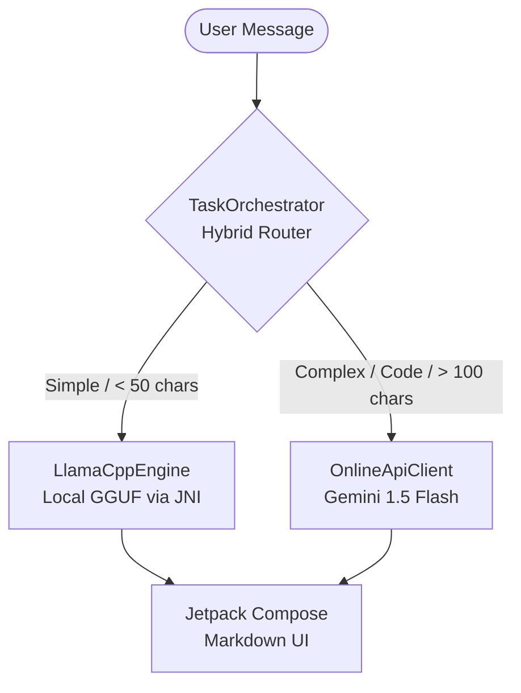

# 🤖 Local AI — Hybrid Android AI Assistant

> A premium, privacy-first Android AI assistant that runs models natively on your device using `llama.cpp` for ultimate privacy, while automatically switching to cloud AI (Gemini 1.5 Flash) for complex logic and coding tasks. Built for low-end devices (~4GB RAM) with OOM (Out-of-Memory) safety guards.

![Screenshot placeholders for Onboarding, Chat, and Settings]

---

## 📱 Features & Capabilities

- **Hybrid Intelligence Router** — Smart `TaskOrchestrator` automatically routes simple/private queries to the offline local engine and complex/analytical queries to the cloud.
- **Native Local Interference** — Directly integrates modern `llama.cpp` using a custom JNI bridge. Supports high-performance memory-mapped (mmap) loading of GGUF models.
- **OOM Safety System** — The `LlamaCppEngine` includes an active RAM constraint monitor (requires Model Size + 300MB buffer available). Protects low-end devices from crashing during model load.
- **Dynamic Threading** — Automatically adapts CPU thread usage based on available cores (clamped between 2 to 6 threads) for battery-efficient token generation.
- **Premium Jetpack Compose UI**
    - **Markdown Rendering:** Full support for code blocks, inline code, bold, italic, and bullet points.
    - **Haptic Feedback:** Physical confirmation on send and keyboard submit.
    - **Adaptive Floating Action Button:** Scroll-to-bottom FAB that disappears when at the newest message.
    - **Empty State & Onboarding:** Animated onboarding flow with interactive dots and a pulsing empty-state view.
- **On-Device Persona System** — Switch between "Helpful Assistant", "Code Wizard", and "Creative Writer". System prompts are injected locally before model processing.
- **DataStore Preferences** — Securely encrypted API key storage and persistent onboarding/persona states.

---

## 🏗️ Architecture



### Key Modules

| Component | Responsibility |
|------|---------|
| `SystemHealthMonitor.kt` | RAM telemetry, OOM guard rails, and context size clamping. |
| `TaskOrchestrator.kt` | Rules-based query router (Local vs. Cloud). |
| `LlamaCppEngine.kt` | JNI interface. Handles tokenization, sampling, and UTF-8 validation. |
| `OnlineApiClient.kt` | Retrofit-based Gemini API integration. |
| `LLMInference.cpp` | Modern `llama.cpp` C++ backend wrapper (no HTTP deps, raw `llama.h` API). |

---

## 🚀 Quick Start & Installation

### 1. Build Requirements
- **Android Studio** Ladybug (or newer)
- **NDK** (Side-by-side) installed via SDK Manager
- **CMake** installed via SDK Manager

### 2. Setup the Project
```bash
git clone https://github.com/Ab-aswini/local-ai.git
```
Open the `local-ai` folder in Android Studio and allow Gradle to sync.

### 3. Add a Local GGUF Model (Offline AI)
1. Download a compatible GGUF model (e.g., Llama 3.2 1B Instruct Q4_K_M).
2. Place the model on your Android device in the `Downloads` or `Documents` folder.
3. In the App's **Settings > 🗄️ Local Models**, enter the exact absolute path to the model file.

### 4. Activate Cloud Fallback (Online AI)
1. Get a **free Gemini API key** at [Google AI Studio](https://aistudio.google.com/app/apikey)
2. Open the App's **Settings > ☁️ Cloud Connect**
3. Paste your API key and tap Save.

### 5. Build and Run
Press **Shift+F10** in Android Studio to build the C++ libraries and deploy the APK to your device.

---

## �️ Tech Stack & Build Details

- **UI:** Jetpack Compose (Material 3)
- **Language:** Kotlin + C++17 (JNI)
- **Concurrency:** Kotlin Coroutines (`viewModelScope`, `Dispatchers.IO`)
- **Persistence:** `androidx.datastore:datastore-preferences`
- **Native AI:** `llama.cpp` (compiled from source via CMake)
- **Network:** Retrofit 2 + Moshi
- **Security:** R8/ProGuard obfuscation enabled for Native libraries.

---

## 🤝 Contributing

This project is actively maintained. PRs adding support for Vulkan backend or expanded RAG (Retrieval-Augmented Generation) document parsing are welcome!

---

*Built with ❤️ for devices that deserve AI autonomy.*
